# Design: "One Basin, Done Right" — an observation-validated flood-hydrology study

- **Date:** 2026-09-09
- **Author:** Ayush Karki
- **Status:** Approved (design) — ready for implementation planning
- **Repo:** `D:\Claude\flood_hydrology_modeling`

---

## 1. Motivation & strategic context

This is a personal portfolio project built to strengthen a funded MSc/PhD application. The
applicant's CV is **strong in machine learning but under-weight in core water-resources domain
science**. Two of three existing research artifacts are ML-first (landslide susceptibility ML;
SWMM ML surrogate); the only domain-forward artifact (Manohara irrigation pre-feasibility) is a
group project buried at the bottom of the CV.

The target professors (from the outreach roster) cluster into: **flood hydrology & rainfall-runoff**
(the largest, highest-fit group — Talchabhadel, Pokhrel, Fang, Bledsoe, Habib, F. Johnson, Sharma),
**hydroinformatics / surrogates / differentiable hydrology** (Shen, Cho, Tolson, Khosronejad),
landslides/geomorphology (already covered by the applicant's paper), sediment/hydraulics
(Yager, Matinpour, B. Johnson), and glaciers/HMA (Rupper, Immerzeel, Haritashya).

**Goal of this project:** produce one **single-author, reproducible, observation-validated**
rainfall-runoff study where domain hydrology is the star and ML is an explicit, secondary footnote —
so a professor skimming the CV reads *"a hydrologist who also commands ML,"* not *"an ML person who
touched water."*

## 2. Goals & non-goals

**Goals**
- Demonstrate genuine hydrologic craft: water balance, calibration, **transferability validation**,
  flood-frequency analysis, and the diagnostics a hydrologist actually checks.
- Be **easy for a non-author to validate**: paired forcing + observed discharge, standard metrics
  (NSE/KGE/PBIAS), published design floods, runnable code.
- Ship inside **1–2 weeks**.
- Leave a clearly-documented **extension roadmap** (hydraulic arc + ML/DL arc) so one tight project
  implies a whole research program the applicant can tailor per professor.

**Non-goals (for Phase 1)**
- No full hydraulic (HEC-RAS) modeling in the core build — documented as extension only.
- No headline ML — at most one clearly-secondary benchmark, only if time remains.
- No bespoke DHM data-purchase dependency on the critical path.

## 3. Design principle

The signal that instantly reads as "real hydrologist" is **validation against observed data using the
field's own diagnostics** — not R². Specifically: calibrate a rainfall-runoff model to a gauge with
**NSE/KGE/PBIAS**, then prove it generalizes with the **Klemeš (1986) differential split-sample test**
(calibrate on wet years, validate on dry, and vice-versa). That single move expresses the applicant's
existing "honest-uncertainty" story in *hydrology's* language and is catnip for Pokhrel, Sharma, Shen,
and Tolson. A **self-coded** conceptual model (not HEC-HMS clicking) proves understanding of the
governing water-balance equations and is fully reproducible.

## 4. Data plan (two tracks — decide after a 1-day availability check)

- **Track A — guaranteed (recommended to start).** A **Caravan / CAMELS** basin in a monsoonal or
  snow-influenced regime (climatically analogous to Nepal). Forcing + observed discharge arrive in one
  download → calibrating on **Day 1**, zero friction. Caravan covers N. America, S. America, Australia,
  Europe (6,830 basins) plus a GRDC extension (25 countries).
- **Track B — Himalaya upgrade (stretch).** A **GRDC** Nepal / Gandaki / Karnali gauge + **CHIRPS or
  ERA5-Land** precipitation and temperature forcing. Higher payoff (Nepal signal, reuses the
  applicant's Karnali geography) but only pursued if observed discharge is obtainable in the first
  1–2 days. If it stalls, ship Track A.

**Decision rule:** spend Day 1 checking Track B data; if paired forcing+Q isn't in hand by end of
Day 2, commit to Track A and treat the Nepal basin as a documented follow-on.

## 5. Method — the domain core

1. **Model:** self-coded **GR4J** (4-parameter daily lumped conceptual model, ~100 lines Python),
   plus an optional **degree-day snow** module (CemaNeige-style) if the basin is snow-influenced.
   Cross-checked against a published reference implementation.
2. **PET:** **Hargreaves** (temperature-based) — a deliberate, justifiable choice for data-sparse
   settings.
3. **Calibration:** maximize **KGE** (Gupta et al. 2009) via a global optimizer (SCE-UA or
   differential evolution). Report **NSE, KGE, PBIAS, logNSE**.
4. **Validation:** Klemeš (1986) hierarchical **split-sample + differential split-sample** test —
   the transferability / non-stationarity signal.
5. **Hydrologist's diagnostics:** flow-duration curve, baseflow separation (Eckhardt / Lyne-Hollick
   filter), runoff ratio, water-balance closure, event hydrographs.
6. **Flood-frequency analysis:** annual-maximum series → fit **GEV + Log-Pearson III** via
   **L-moments**; return periods (Q₂…Q₁₀₀) with confidence intervals; compared to any published
   design flood.

## 6. Optional ML extension (explicitly secondary — only if ahead of schedule)

A single, clearly-labeled benchmark: an **LSTM streamflow model vs. the GR4J process model**, judged
**on the Klemeš differential split-sample test** (which transfers to unseen dry/wet or ungauged
conditions — not which fits best on average), with the applicant's **Mahalanobis applicability-domain
gate** flagging when the data-driven model should *not* be trusted. Framed as ML *resolving a hydrology
question* (robustness under non-stationarity; reliability in data-sparse basins), never as a
leaderboard win.

## 7. Deliverables

- GitHub repo mirroring the polish of the SWMM surrogate project (clean, runnable, documented).
- A **4–6 page report**, ordered **hydrology-first**: basin → model → calibration → **validation** →
  flood frequency → (ML footnote) → limitations / uncertainty → extension roadmap.
- Figures: event hydrographs, flow-duration curve, split-sample results table, flood-frequency curve
  with confidence bands.

## 8. Timeline (1–2 weeks)

| Days | Work |
|---|---|
| 1–2 | Data-availability check (Track A vs B); forcing/discharge QC; PET computation |
| 3–5 | Code GR4J (+ optional snow); calibrate (KGE / SCE-UA); split-sample validation |
| 6–7 | Flood-frequency analysis; domain diagnostics; figures |
| 8–10 | Writeup, README, limitations/uncertainty. **ML extension only if time remains** |

## 9. Extension roadmap (documented, not built in Phase 1)

### 9a. Hydraulic arc — the downstream half of the same pipeline

Hydrology solves **mass balance** → discharge. Hydraulics adds the **momentum equation**; together they
are the **Saint-Venant (shallow-water) equations**. Narrative:
*rainfall → runoff → design discharge → routing → water-surface profile → inundation → sediment.*

| # | Extension | Physics | Feeds off | Validation | Best for |
|---|---|---|---|---|---|
| 1 | Channel flood routing (Muskingum / Muskingum-Cunge) | Kinematic/diffusive wave | GR4J hydrograph | Routed vs. downstream gauge (NSE/KGE) | Cheap, self-codable first add-on |
| 2 | 1D water-surface profiles (rating curves, backwater) | Gradually-varied flow, Manning | Flood-frequency Q | Surveyed cross-sections / rating curve | Uses existing HEC-RAS |
| 3 | 2D flood inundation of a real event | Full 2D shallow-water | A dated flood peak | **Sentinel-1 SAR** extent (CSI/hit-rate) | Fang, Bledsoe, Habib, Khosronejad, Boufadel |
| 4 | Dam-break / GLOF routing | 1D unsteady Saint-Venant (self-coded) | Lake/reservoir volume | Documented Nepal GLOF | Pokhrel + Himalaya-hazard framing |
| 5 | Sediment transport / morphodynamics | Exner + Meyer-Peter-Müller | Hydraulic velocities | Observed bed change / sediment rating | Yager, Matinpour, West |
| 6 | Hydraulic ML surrogate (emulate the 2D model) | Data-driven on physics runs | #3 outputs | Held-out event error + AD gate | Khosronejad + reuses SWMM-surrogate skill |

**Committed near-term (documented as concrete future work):** #1 (Muskingum, ~30 lines) and #2
(1D profiles from design discharges). **Flagship follow-on:** #3 (2D inundation vs. Sentinel-1).

### 9b. ML/DL arc

| Extension | What it is | Novelty | Professor payoff |
|---|---|---|---|
| LSTM vs. GR4J transferability benchmark | Fair comparison on the Klemeš test | Core / frontier | Shen, Sharma, Cho, Fang |
| Regionalization / PUB | Predict params/flows in ungauged neighbour from attributes | Core (reuses AD + spatial-CV) | Shen, Sharma |
| Differentiable / hybrid (dPL) | NN learns process-model parameters; physics in the loop | Frontier (advanced) | Shen (his exact program) |
| Reliability / AD layer | Mahalanobis gate on data-driven predictions | Applicant's differentiator | Cho, Shen, Rabus |
| Post-processing / error correction | ML corrects process-model residuals | Useful, lower novelty | General |

**Guiding rule for the whole ML arc:** ML stays a *labeled footnote that resolves a hydrology
question*, never the headline — to protect the CV-rebalancing goal.

## 10. Professor mapping (why each piece exists)

- **Core hydrology (calibration + Klemeš + flood freq):** Talchabhadel, Pokhrel, Fang, Bledsoe,
  Habib, F. Johnson, Sharma.
- **Self-coded model + hydroinformatics craft:** Cho, Shen, Tolson, Khosronejad.
- **Nepal/Himalaya basin (Track B):** Pokhrel, Talchabhadel, Clark, Rupper.
- **Hydraulic arc (#3 especially):** Fang, Bledsoe, Habib, Khosronejad, Boufadel.
- **ML arc (LSTM/regionalization/AD):** Shen, Sharma, Cho, Rabus.

## 11. Success criteria

- Calibrated model achieves defensible KGE on an **independent** validation period (not just
  calibration fit).
- **Differential** split-sample results reported honestly (including where transferability degrades).
- Flood-frequency curve reproduces or brackets a published design flood where available.
- A third party can clone the repo and reproduce the headline figures from raw data.
- Report reads hydrology-first; ML (if included) is visibly secondary.

## 12. Risks & mitigations

| Risk | Mitigation |
|---|---|
| Nepal (Track B) discharge data not obtainable in time | Day-2 decision rule → fall back to guaranteed Track A |
| Snow-driven basin biases a no-snow model | Pick a monsoon-dominated basin, or add degree-day snow module |
| Scope creep into hydraulics/ML | Both are roadmap-only in Phase 1; ML gated on finishing early |
| Overfitting / calibration optimism | Klemeš differential split-sample is the explicit guard |

## 13. Tools & references

- **Data:** Caravan (Kratzert et al., *Sci. Data* 2023), CAMELS, GRDC portal, CHIRPS, ERA5-Land.
- **Methods:** GR4J (Perrin et al. 2003), CemaNeige snow, Hargreaves PET, KGE (Gupta et al. 2009),
  NSE (Nash-Sutcliffe 1970), Klemeš (1986) split-sample testing, L-moments (Hosking), GEV / Log-Pearson III.
- **Stack:** Python (NumPy, pandas, SciPy, Matplotlib), optional `lmoments3`, optional PyTorch (LSTM).

## 14. Finalized data decisions (LLM council, 2026-09-11)

These are the locked data choices for the Track A CAMELS-AUS v2 build, decided via a 5-advisor council + peer review. Basin = gauge 114001A.

| Step | Decision | Rationale |
|---|---|---|
| Basin | **114001A**, single basin (reject multi-basin as timeline-fatal scope creep). | Raw 100%-complete record + closed water balance means validation tests the model, not gap-filling; humid, snow-free, DJF-monsoon regime suits GR4J (no snow module needed). It is the **NORTH QUEENSLAND** Murray (Tully–Murray region, lat −18.1, 155 km²), **NOT** the Murray–Darling — must be labeled clearly in the report. |
| Discharge | **raw `streamflow_mmd.csv`** (mm/day), NOT `streamflow_MLd_inclInfilled.csv`. | Infilled gaps were filled by BoM using GR4J; validating a GR4J against GR4J-infilled "observations" is circular target-leakage. 114001A is 100% complete on raw, so nothing is lost. |
| Precipitation | **AGCD primary**, **SILO as a reported sensitivity run** (parameterized forcing filename). | AGCD's higher volume (2009 vs 1840 mm/yr) closes the verified water balance; SILO's −8.4% would force compensating distortion in the production-store parameter. Daily corr AGCD~SILO = 0.962; extremes nearly identical. SILO run is a genuine forcing-uncertainty result, not a throwaway footnote. |
| PET | **self-coded Hargreaves** (temperature-only), validated against the dataset's Morton PET within 3.5% (1450 vs 1502 mm/yr). | Framed as implementation transparency / demonstrated craft, **not** as superior accuracy (GR4J is PET-insensitive). The earlier "transfers to data-sparse Nepal" rationale is **dropped** (Nepal met data includes radiation/humidity; this AU study won't be repeated for Nepal). |
| Calibration/validation window | 1970–2022; **2-year warm-up** (not 1); **Jul–Jun water-year**; wet/dry split by ranking complete water-years by annual P and splitting at the median; then Klemeš hierarchical + differential split-sample. | 2-yr warm-up costs nothing in 52 years and suits slow stores; Jul–Jun water-year preserves the DJF monsoon (a calendar split would shred the flood season). Start metric accumulation **after** warm-up rather than trimming the DataFrame, to avoid an off-by-one bug. |

### 14a. Blind spots caught in peer review (must address in the build/report)

1. **Daily-timestep vs flood-peak mismatch** — daily lumped GR4J cannot resolve sub-daily flash peaks on a 155 km² tropical catchment. Fitting GEV to daily-mean annual maxima and reading off Q₁₀₀ is a support/scale mismatch. Fix: state this limitation explicitly; frame flood-frequency as analysis of the daily-mean annual-max series + signatures (not instantaneous peak reproduction); if available, validate against a published/BoM flood-frequency estimate for gauge 114001A.
2. **Observation uncertainty floor** — "100% complete" ≠ "accurate." High-flow rating-curve extrapolation is least reliable exactly in the flood regime being studied. Report the gauge's rating/QA quality and treat it as an error floor.
3. **GEV on ~52 annual maxima needs confidence intervals** — report return levels with uncertainty bands (L-moments + the spec's Log-Pearson III cross-check), never bare point estimates.
4. **Non-stationarity over 1970–2022 threatens the GEV stationarity assumption** — acknowledge it; note it reinforces (not undermines) the Klemeš differential split-sample transferability narrative.
5. **Reproducibility spec signals "real hydrologist" more than any single forcing/PET choice** — state the objective function (KGE), parameter bounds, optimizer (SCE-UA / differential evolution), random seed, and warm-up bookkeeping; include a data/code availability statement (repo + dataset DOI/version + environment lockfile).

## 15. End-to-end pipeline flowchart

Data-to-report pipeline. Diamonds are **decision gates** that must pass before proceeding;
`[DONE]` / `[NEXT]` mark progress. Node text is plain ASCII for portable rendering. The five
section-14a blind-spot checkpoints are in the table below, keyed to the step they constrain.

```mermaid
flowchart TD
    D1["PHASE 0 - DATA  [DONE]<br/>CAMELS-AUS v2, Zenodo 13350616, subsets 01-05"]
    D2["Screen 561 basins (ClimaticIndices.csv)<br/>snow-free, humid, DJF-monsoon, long record"]
    D3["SELECT gauge 114001A<br/>N-QLD Murray, 155 km2, HRS reference gauge"]
    D4["prepare_basin_data.py + self-coded Hargreaves PET<br/>build basin_114001A.csv"]
    D6{"QC GATE:<br/>water balance closes?"}
    D7["basin_114001A.csv ready<br/>P_AGCD, PET_Har, Q_raw (plus SILO, Morton)"]
    D1 --> D2 --> D3 --> D4 --> D6
    D6 -->|"yes, ratio 0.56"| D7
    D6 -->|"no, reselect"| D2

    M1["PHASE 1 - MODEL  [NEXT]<br/>code GR4J, ~100 lines"]
    M2{"VERIFY GATE:<br/>matches airGR / Perrin 2003?"}
    M3["GR4J verified, no snow module"]
    D7 --> M1 --> M2
    M2 -->|"no, debug"| M1
    M2 -->|"yes"| M3

    C1["PHASE 2 - CALIBRATE + VALIDATE<br/>objective KGE, SCE-UA/DE, 2-yr warmup, Jul-Jun year"]
    C2["Split water-years by annual P at median: WET / DRY"]
    C3["Split-sample: calibrate A, validate B"]
    C4["Differential SST: WET-to-DRY and DRY-to-WET"]
    C5["Metrics per period: NSE, KGE, PBIAS, logNSE"]
    M3 --> C1 --> C2 --> C3 --> C4 --> C5

    S1{"Ahead of schedule?"}
    S2["SILO forcing sensitivity run"]
    C5 --> S1
    S1 -->|"yes"| S2 --> DG1
    S1 -->|"no"| DG1

    DG1["PHASE 3 - DIAGNOSTICS<br/>FDC, baseflow separation, event hydrographs, WB closure"]
    F1["PHASE 4 - FLOOD FREQUENCY<br/>annual-max daily-mean Q per water-year, ~52 points"]
    F2["Fit GEV + Log-Pearson III via L-moments"]
    F3["Return levels Q2 to Q100 with confidence intervals"]
    F4["Compare to published / BoM flood estimate"]
    DG1 --> F1 --> F2 --> F3 --> F4

    O1{"ML footnote?<br/>only if time remains"}
    O2["LSTM vs GR4J on DSST + Mahalanobis AD gate"]
    R1["PHASE 6 - REPORT (hydrology-first)<br/>basin, model, calib, VALIDATION, flood, limits"]
    R2["Figures + reproducibility statement<br/>repo, dataset DOI, lockfile, seed, param bounds"]
    F4 --> O1
    O1 -->|"yes"| O2 --> R1
    O1 -->|"no"| R1
    R1 --> R2
```

**Blind-spot checkpoints (section 14a), keyed to the step:**

| Step | Checkpoint |
|---|---|
| D7 - discharge | "100% complete" is not "accurate": report rating/QA as an error floor (HRS status mitigates, does not remove). |
| C4 - DSST | Non-stationarity over 1970-2022 threatens GEV stationarity but reinforces the differential-split narrative. |
| F1 - annual max | Daily-mean annual max is not the instantaneous peak: frame FFA on the daily-mean series and state the caveat. |
| F3 - return levels | Report confidence intervals on Q2..Q100; never bare point estimates from ~52 maxima. |
